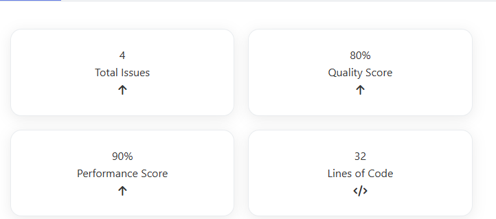
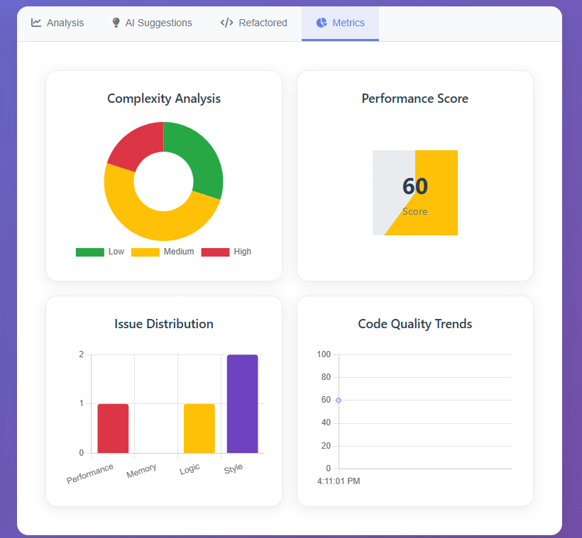
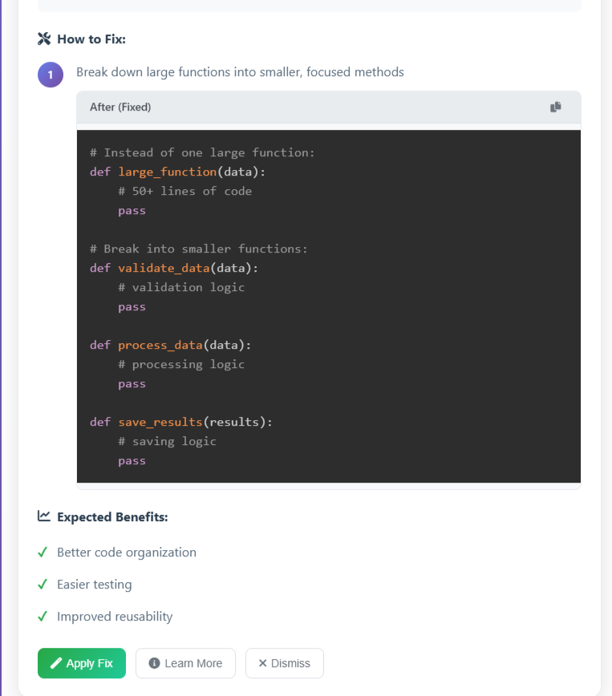
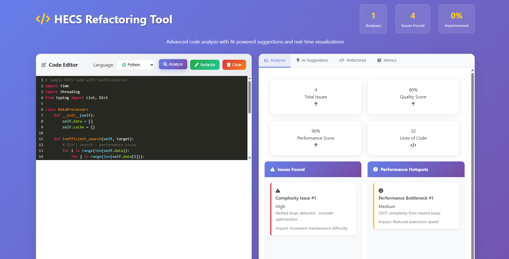

# HECS Refactoring Tool

> **Advanced AI-Powered Code Analysis & Refactoring Platform**

A sophisticated web-based tool that combines static code analysis with AI-powered suggestions to automatically detect performance bottlenecks, code smells, and complexity issues in your codebase. Built specifically for HECS (Hierarchical Entity Component System) patterns but extensible to any codebase.



## ✨ Key Features

### 🔍 **Intelligent Code Analysis**
- **Real-time complexity analysis** with visual metrics
- **Performance bottleneck detection** using AST parsing
- **Security vulnerability scanning**
- **Code smell identification** and quality assessment
- **HECS pattern recognition** for entity-component systems

### 🤖 **AI-Powered Suggestions**
- **Ollama integration** for intelligent refactoring recommendations
- **Context-aware suggestions** based on code analysis
- **Step-by-step improvement guides**
- **Best practices enforcement**

### 📊 **Visual Metrics Dashboard**


- **Performance Score Visualization** with interactive charts
- **Complexity Analysis** with trend tracking
- **Issue Distribution** across different categories
- **Real-time code statistics** (lines, characters, complexity)

### ⚡ **Automated Refactoring**


- **One-click code optimization**
- **Loop optimization** (nested loop detection and improvement)
- **List comprehension suggestions**
- **Performance pattern improvements**
- **Memory leak prevention**

### 🎯 **Smart Suggestions Panel**


- **Priority-based recommendations**
- **Category-organized suggestions** (Performance, Security, Quality)
- **Detailed impact analysis**
- **Code location pinpointing**
- **Expected improvement metrics**

## 🛠️ Technology Stack

- **Backend**: Python Flask + SocketIO for real-time communication
- **Frontend**: Modern JavaScript with CodeMirror editor
- **AI Engine**: Ollama integration for intelligent suggestions
- **Analysis**: AST parsing with custom HECS pattern detection
- **Visualization**: Chart.js for interactive metrics
- **Styling**: Modern CSS with responsive design

## 🚀 Quick Start

### Prerequisites
- Python 3.8+
- Node.js (for frontend dependencies)
- Ollama (for AI suggestions)

### Installation

```bash
# Clone the repository
git clone https://github.com/yourusername/hecs-refactoring.git
cd hecs-refactoring

# Install Python dependencies
pip install -r requirements.txt

# Start Ollama (for AI features)
ollama serve

# Run the application
python gui_app.py
```
